# OrangeAd Mock Webcam - Workflow Diagrams

## System Architecture Overview

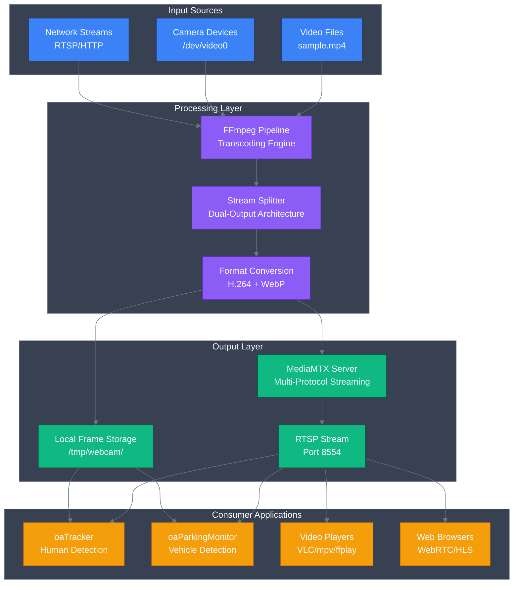

## Dual-Output Architecture Flow

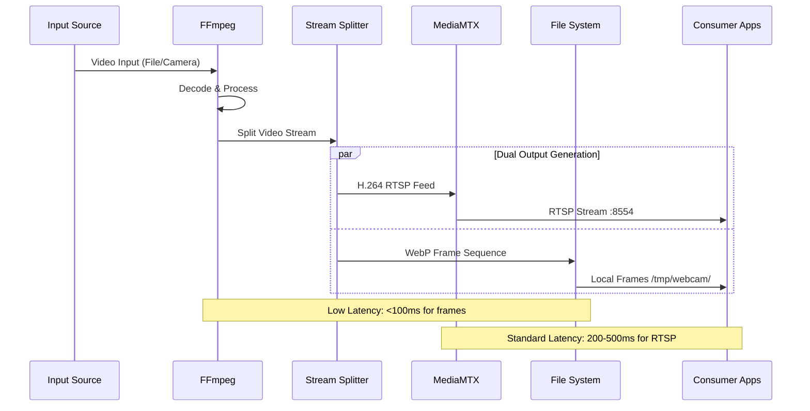

## Service Lifecycle Management

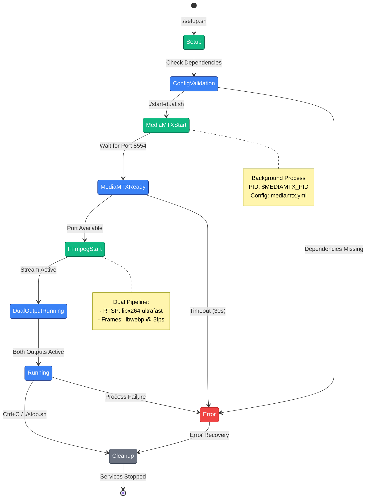

## Multi-Protocol Streaming Architecture

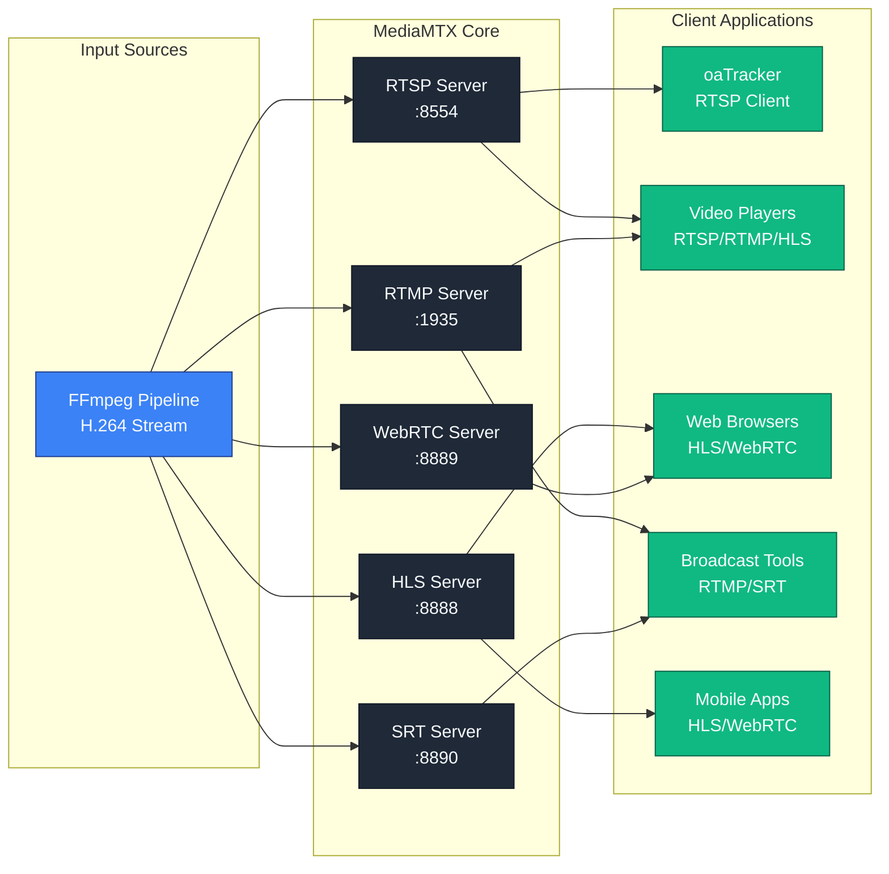

## Configuration Management Flow

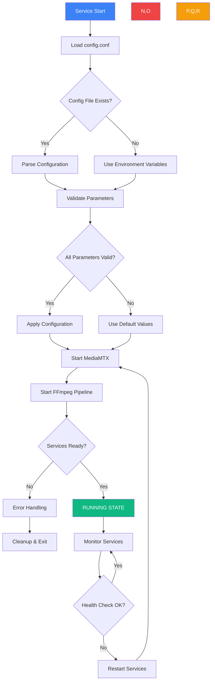

## Resource Management Flow

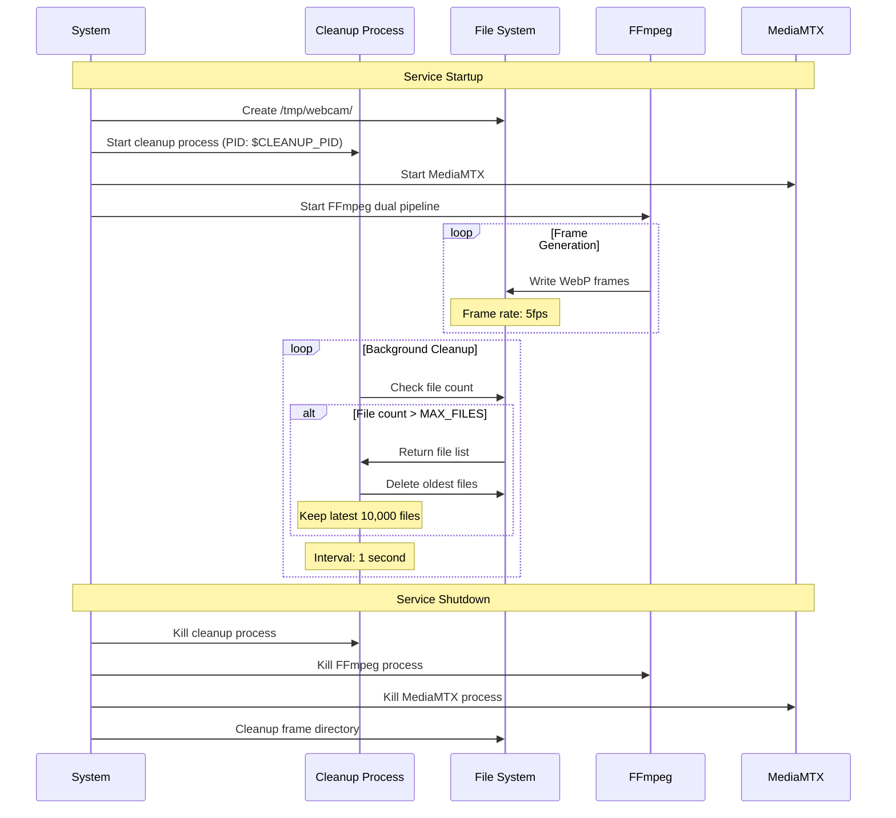

## Error Handling and Recovery Flow

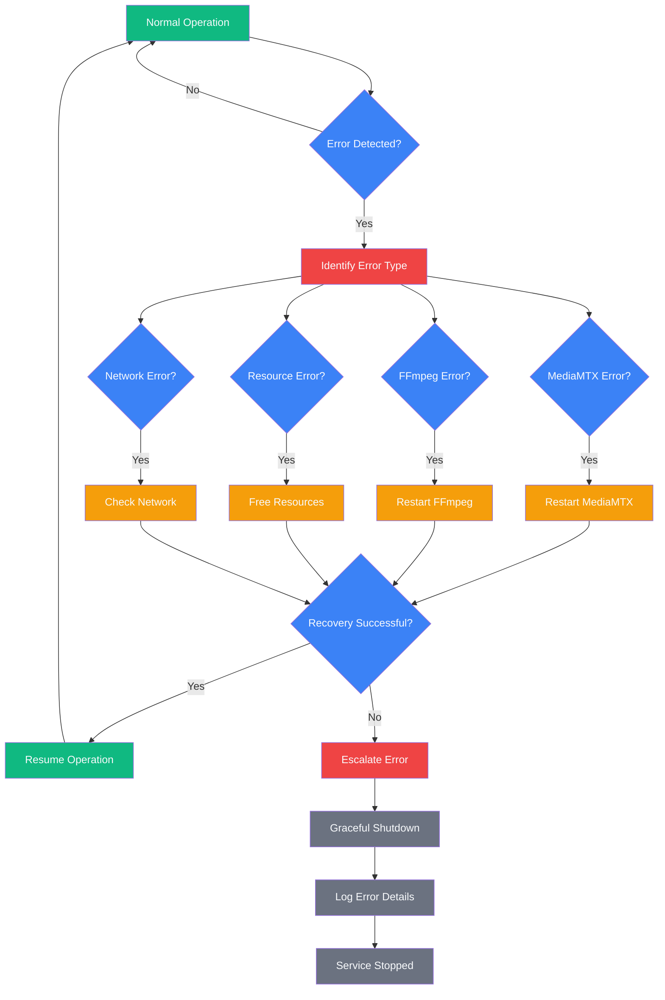

## Integration with OrangeAd Ecosystem

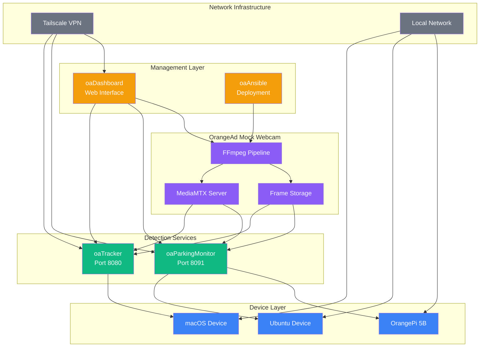

## Performance Optimization Workflow

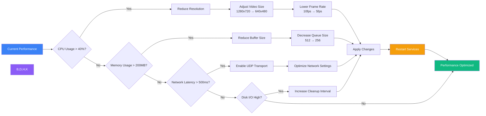

## Debugging and Troubleshooting Flow

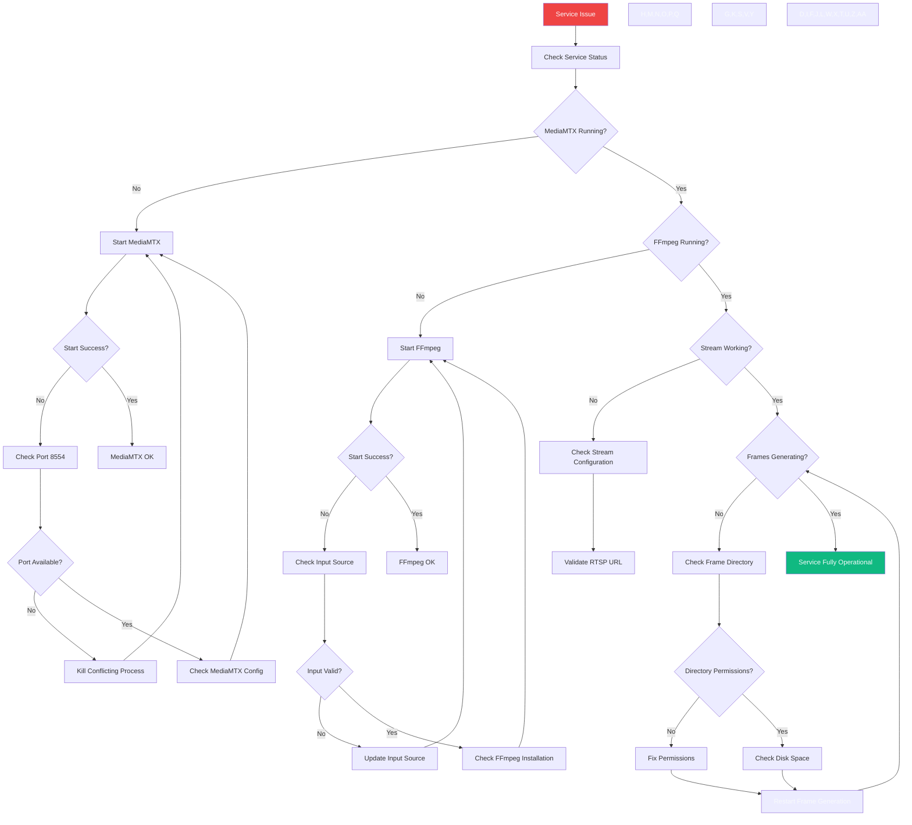

## Deployment Scenarios

### Single Device Deployment
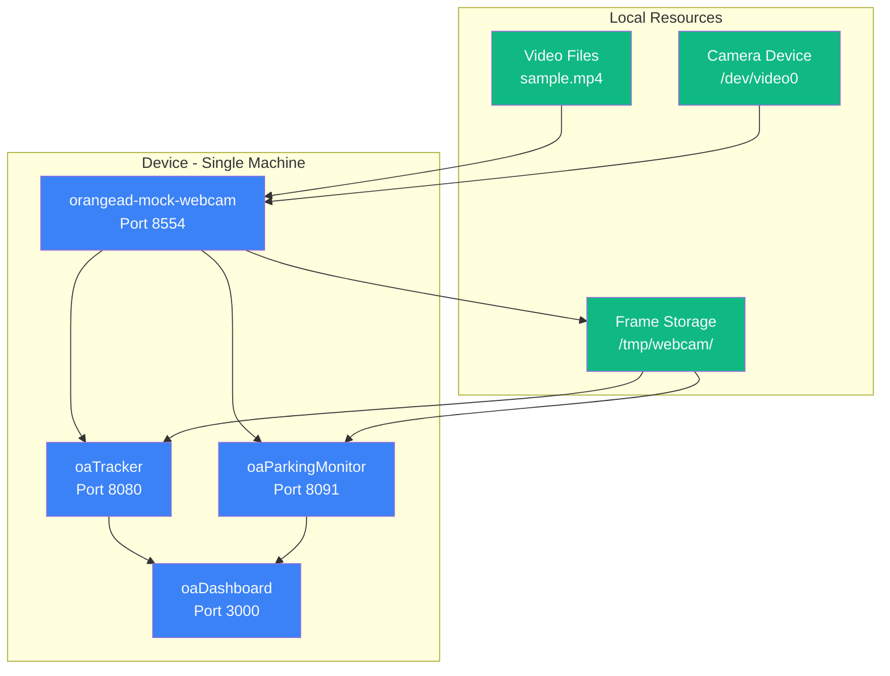

### Multi-Device Network Deployment
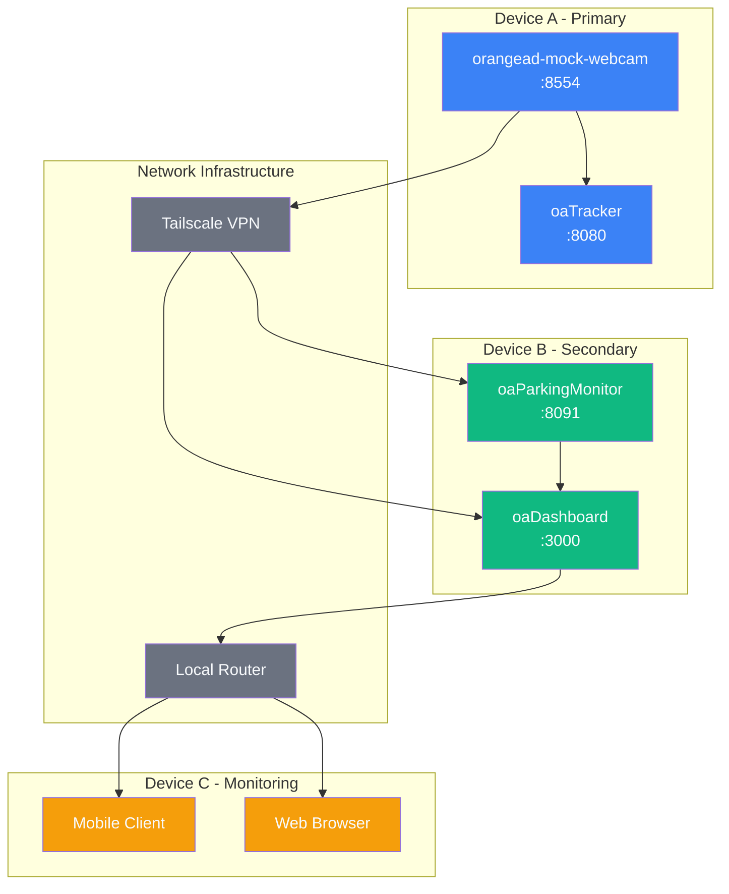

---

**Diagram Standards Used:**
- **High Contrast Colors**: Dark backgrounds (#1f2937, #1e293b) with light text (#f8fafc)
- **Consistent Color Coding**: Blue for input, purple for processing, green for output
- **Clear Flow Direction**: Left-to-right and top-to-bottom flow patterns
- **Comprehensive Coverage**: All major system workflows represented
- **Integration Focus**: OrangeAd ecosystem connections clearly shown

**Last Updated**: October 2025
**Diagrams Created**: 12 comprehensive workflow diagrams
**Styling**: High-contrast accessibility compliant